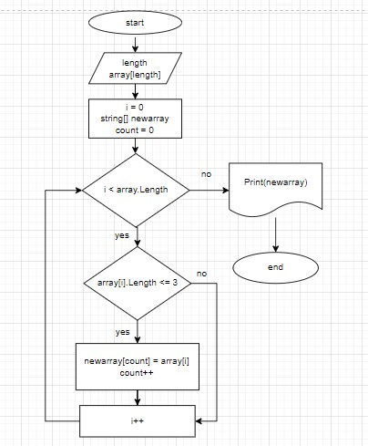

# Итоговая проверочная работа

## Задача:
 _**Написать программу, которая из имеющегося массива строк формирует новый массив из строк, длина которых меньше, либо равна 3 символам. Первоначальный массив можно ввести с клавиатуры, либо задать на старте выполнения алгоритма. При решении не рекомендуется пользоваться коллекциями, лучше обойтись исключительно массивами.**_

_Для полноценного выполнения проверочной работы необходимо:_

1. Создать репозиторий на GitHub
2. Нарисовать блок-схему алгоритма
3. Снабдить репозиторий оформленным текстовым описанием решения
4. Написать программу, решающую поставленную задачу
5. Использовать контроль версий в работе над этим небольшим проектом (не должно быть так, что всё залито одним коммитом, как минимум этапы 2, 3, и 4 должны быть расположены в разных коммитах)

## Ход решения задачи
> 1. Создать репозиторий на GitHub
* Репозиторий распологается по этому [адресу](https://github.com/Ilya-Scherbakov/Control_Works.git 'перейдите по ссылке https://github.com/Ilya-Scherbakov/Control_Works.git').

> 2. Нарисовать блок-схему алгоритма
* 

> 3. Снабдить репозиторий оформленным текстовым описанием решения
* На старте программы пользователь задает длинну массива array
* С помощью метода createArr создаем массив array. Пользователь сам вводит элементы массива.
* Полученный массив выводится в консоль с вызовом метода PrintArray.
* Метод createNewArr создает новый массив и путем перебора старого массива ищет элементы удовлетворяющих условию.
* В цикле метода создается новый массив и после выводит его в консоль.
